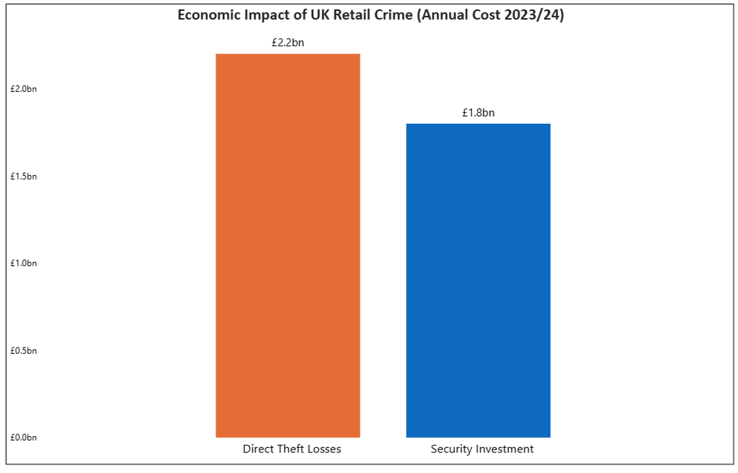
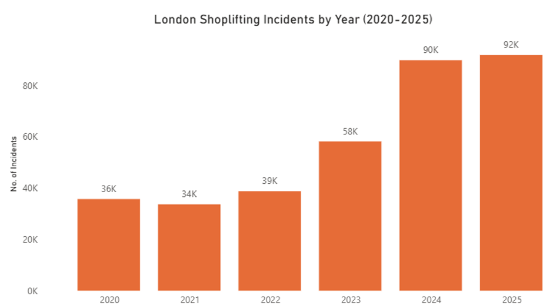
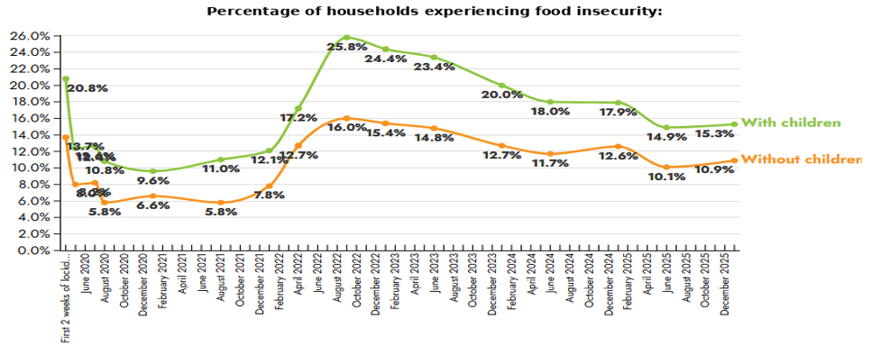
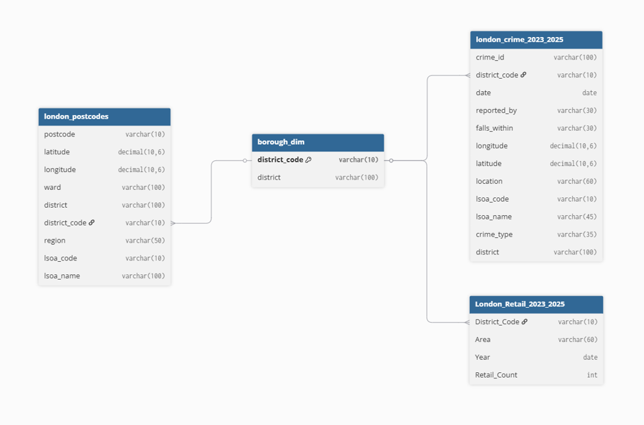
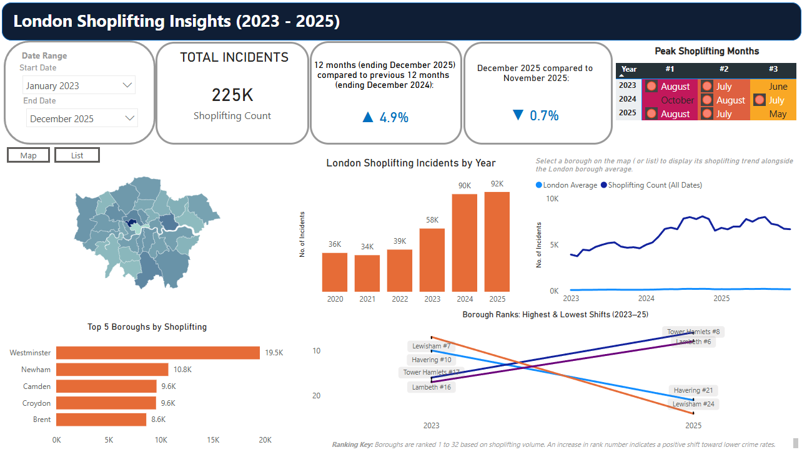
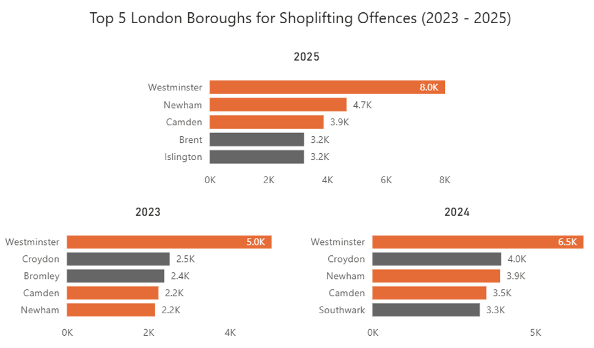
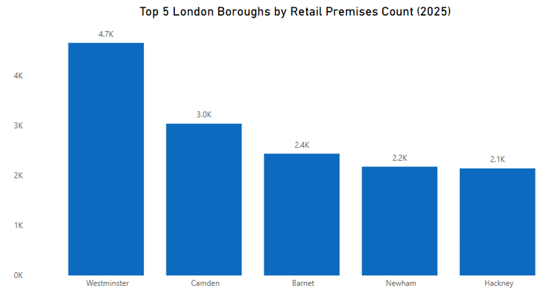
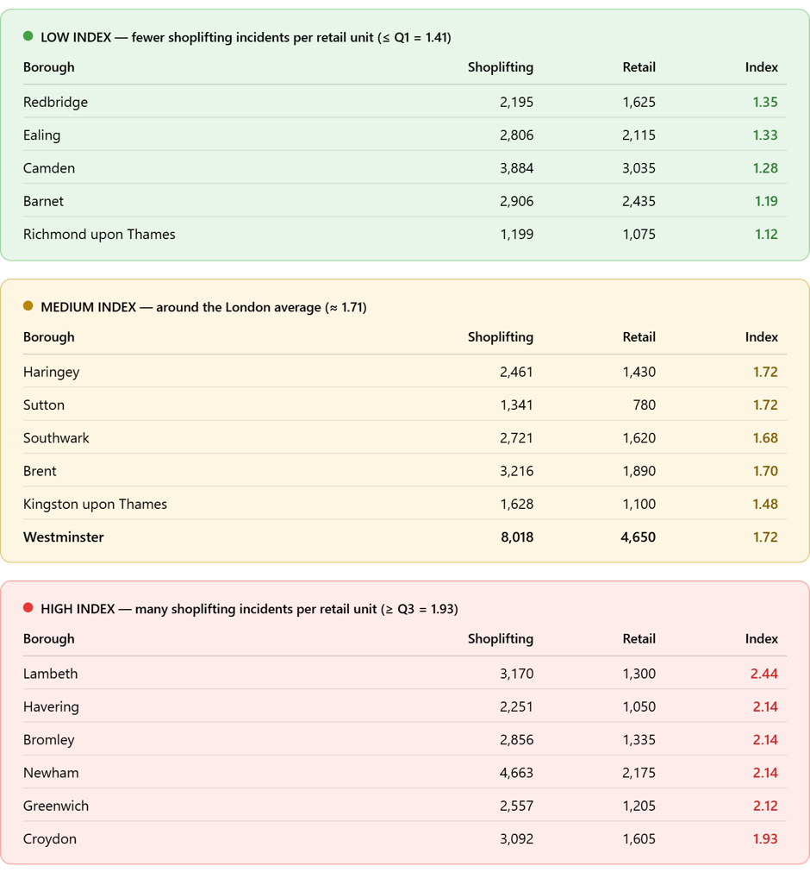
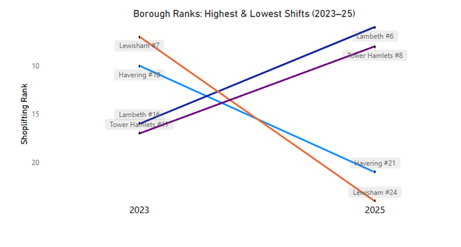
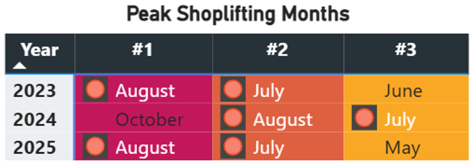

# Mapping Retail Crime in London: Shoplifting Patterns, Risk Hotspots and Strategic Guidance for Retailers (2023–2025)

*Built in SQL Server and Power BI from Metropolitan Police and Office for National Statistics open data. · Mubtasin Q.*

## Contents

- [Project Background](#project-background)
  - [Project at a glance](#project-at-a-glance)
- [Shoplifting in Context](#shoplifting-in-context)
  - [The cost to UK retailers](#the-cost-to-uk-retailers)
  - [London in 2025](#london-in-2025)
  - [Determinants of shoplifting](#determinants-of-shoplifting)
- [Key Insights & Recommendations](#key-insights--recommendations)
- [Data Model & Initial Checks](#data-model--initial-checks)
  - [Key data components](#key-data-components)
  - [Data cleaning and validation](#data-cleaning-and-validation)
  - [Project repository](#project-repository)
  - [London Shoplifting Dashboard](#london-shoplifting-dashboard)
- [Deeper Insights](#deeper-insights)
  - [1. Slower shoplifting growth still supports security investment](#1-slower-shoplifting-growth-still-supports-security-investment)
  - [2. Where volumes sit: three boroughs dominate](#2-where-volumes-sit-three-boroughs-dominate)
  - [3. The busiest boroughs are not the hardest hit per store](#3-the-busiest-boroughs-are-not-the-hardest-hit-per-store)
  - [4. The largest improvement coincided with a change in incident reporting](#4-the-largest-improvement-coincided-with-a-change-in-incident-reporting)
  - [5. Summer peaks help retailers plan ahead](#5-summer-peaks-help-retailers-plan-ahead)
- [Recommendations](#recommendations)
  - [1. Hold security spend steady, with the option to scale back](#1-hold-security-spend-steady-with-the-option-to-scale-back)
  - [2. Where to direct the spend across boroughs](#2-where-to-direct-the-spend-across-boroughs)
  - [3. Fund guarding and reporting first; test facial recognition before expanding](#3-fund-guarding-and-reporting-first-test-facial-recognition-before-expanding)
  - [4. Front-load resourcing into July and August](#4-front-load-resourcing-into-july-and-august)

# Project Background

London recorded approximately 92,000 shoplifting offences in 2025, the highest annual total on record, although the rate of increase slowed sharply that year after a 55% rise in 2024. Retailers are therefore weighing two things at once: whether to sustain record levels of security investment against a record level of theft, where that investment should go and what it should be spent on.
To answer these questions, the project draws on the Metropolitan Police Service (MPS) monthly crime dataset, a repository of more than three million records spanning 2023 to 2025. SQL Server was used to clean, transform and model the data, extracting over 220,000 shoplifting incidents and joining them to retail unit counts from the Office for National Statistics (ONS) and postcode references. The data were visualised in Power BI to compare shoplifting across London's 33 boroughs. The dashboards show which boroughs recorded the highest incident counts, which boroughs improved or worsened between 2023 and 2025, and which months carried the highest totals.
The project brings these findings together to inform three decisions: whether to spend more, where to direct resources, and what to invest in.

## Project at a glance

| **Dataset** | [Metropolitan Police Service (MPS) crime files, 2023–2025](https://data.police.uk/data/): 3 million records, 220,000 shoplifting incidents. [ONS retail unit counts](https://data.london.gov.uk/dataset/local-units-by-broad-industry-group-borough-29jny) and London postcode reference data. |
| --- | --- |
| **Tools** | SQL Server, Power BI |
| **Data model** | Four tables. Two facts at different grains, joined through a conformed borough dimension keyed on `district_code`. |
| **Analysis** | Borough volumes, year-on-year change, the Shoplifting-to-Retail Index and monthly seasonality. |
| **Code** | [GitHub repository](https://github.com/Muba730/london-shoplifting-analysis) |
| **Dashboard** | [London Shoplifting: Trends and Hotspots (2023 - 2025)](https://app.powerbi.com/links/PT3idvF7jb?ctid=cba74438-244f-497c-8cf7-253877d268fb&pbi_source=linkShare) |

# Shoplifting in Context

## The cost to UK retailers

The British Retail Consortium's (BRC) 2025 survey estimated UK customer-theft losses of a **record high** £2.2 billion and prevention spending of £1.8 billion, up from £1.2 billion in the previous survey (Figure 1). These estimates cover 2023/24. They show the wider challenge for retailers, who face both stock losses and the cost of prevention. That spending has risen because the UK has been recording historically high levels of shoplifting, and London has followed the same trend.

*Figure 1. UK customer-theft losses against prevention spending, 2023/24.*

*Source: *[*BRC Retail Crime Survey 2025*](https://brc.org.uk/news-and-events/news/operations/2025/ungated/brc-retail-crime-survey-2025/)

## London in 2025

London recorded approximately 92,000 shoplifting offences in 2025, the highest annual total on record. The pace of that rise has changed, though: volumes climbed 55% between 2023 and 2024, then slowed to 2% in 2025 (Figure 2).

*Figure 2. London shoplifting offences by year, 2020–2025.*

That slowdown followed a period of coordinated response. The Retail Crime Action Plan, introduced in 2023, committed police forces to attending more retail crime reports and standardised how retailers submit evidence. Retailers moved in parallel, increasing guarding, staff evidence training and trials of facial recognition. Further measures in the Crime and Policing Act 2026, introduced in April 2026, may help reduce theft, although a return to 2022–2023 levels remain uncertain.
London's shoplifting has stopped accelerating while remaining at a record level. That leaves retailers with an open question about their own budgets: whether to treat this level as the new normal and plan permanent spending around it, or to treat it as a peak that law enforcement will bring down, allowing security costs to fall back. Until the trend answers that question, the uncertainty itself is what they are budgeting against.

## Determinants of shoplifting

Several factors could contribute, including the pressure that living costs, unemployment or falling real wages can place on household budgets. However, the food-insecurity figures suggest that economic hardship alone is unlikely to explain the pattern (Figure 3).

*Figure 3. UK households experiencing food insecurity, with and without children, 2020–2025.*

*Source: *[*Food Insecurity Tracking, The Food Foundation*](https://foodfoundation.org.uk/initiatives/food-insecurity-tracking)
The Food Foundation's tracking shows that food insecurity among UK households with children fell from a peak of 25.8% in 2022 to 15.3% at the end of 2025. Recorded shoplifting in London continued to rise over the same period, so the two trends did not move together. Organised retail crime is another possible factor: the BRC's 2025 survey reports gangs systematically targeting multiple stores. Such coordinated offending broadens the discussion beyond theft for personal use.

# Key Insights & Recommendations

| **Insight Area** | **Key Findings** | **Strategic Recommendation** |
| --- | --- | --- |
| **Should retailers increase security spending?** | London's recorded shoplifting reached approximately 92,000 incidents in 2025, an all-time high. The Crime and Policing Act may bring volumes down in 2026, but its impact remains to be seen. | Retailers should increase security spending now, while remaining ready to scale it back if more effective policing reduces local theft. |
| **Where should retailers invest their security resources?** | Westminster, Camden and Newham remain high-shoplifting boroughs, while Lambeth and Tower Hamlets show emerging pressure. The retail index also identifies Lambeth and Bromley, among others, as boroughs with high shoplifting levels relative to their retail footprint. | Maintain strong security coverage in established hotspots and respond early to emerging ones. Prioritise additional resources in boroughs with high shoplifting levels relative to their number of retail premises. |
| **What should retailers invest in and how?** | Retail security investment covers personnel, CCTV, anti-theft devices and body-worn cameras. Better incident reporting can also support coordination with police. | Strengthen guarding, staff training and theft-prevention tools, supported by coordinated police reporting. Test newer technology such as facial recognition through limited trials, assessing outcomes, costs and implementation requirements before wider rollout. |
| **Seasonal shoplifting patterns** | July and August consistently ranked among the highest months for recorded shoplifting across 2023–2025, providing a basis for seasonal security planning. | Plan additional security coverage ahead of peak months. Increase staffing, refresh staff briefings and coordinate with local police to prepare for the recurring summer rise. |

# Data Model & Initial Checks

The ShopliftingDB model was built in SQL Server using four core tables. The crime table holds individual incidents, while the retail table holds annual borough counts. The `borough_dim` table serves as a shared lookup, using `district_code` from the postcode data to give both tables a consistent borough reference (Figure 4).

## Key data components

- **`london_crime`:** shoplifting records with dates, locations and small-area geographic codes, filtered from the wider crime dataset.
- **`London_Retail`:** annual retail unit counts for 2023–2025, used to calculate the shoplifting-to-retail count index.
- **`London_Postcodes`:** postcode and geographic references used to assign crime records to boroughs.
- **`borough_dim`:** one borough reference per `district_code`, linking the crime and retail tables consistently.

*Figure 4. Entity relationship diagram: district_code links the crime and retail tables through borough_dim.*

## Data cleaning and validation

Source CSV files were loaded into a raw schema in SQL Server, with separate clean tables prepared for analysis. Transformations filtered crime records to shoplifting and standardised reporting months and retail years as date fields.
The postcode CSV stored 2011 and 2021 geographic codes in separate columns, while the codes in crime records could follow either version. Both sets were combined into a single lookup to match incidents to boroughs consistently. A shared borough dimension then linked the crime and retail tables while preserving their different levels of detail: individual incidents and annual retail counts.
Data quality checks covered missing values, duplicate crime IDs, unmatched boroughs and invalid retail counts. Retail records were also checked for geographic coverage and duplicate borough–year combinations. Repeated postcodes linked to different geographic boundary versions were retained intentionally.

## Project repository

The repository holds the SQL behind the pipeline. The main parts are:

- [**Raw table scripts**](https://github.com/Muba730/london-shoplifting-analysis/blob/7309fb3809eb9b6d934ad68eee8a0f71c08f0c80/sql/01_create_and_load_raw_tables.sql) — create the raw tables and load the MPS crime, ONS retail and postcode source files. *(*
- [**Cleaned table scripts**](https://github.com/Muba730/london-shoplifting-analysis/blob/7309fb3809eb9b6d934ad68eee8a0f71c08f0c80/sql/02_clean_and_model_data.sql) — filter records to shoplifting, standardise the date fields, resolve the 2011 and 2021 postcode codes and build the borough dimension. *(link to add)*
- [**Data quality checks**](https://github.com/Muba730/london-shoplifting-analysis/blob/7309fb3809eb9b6d934ad68eee8a0f71c08f0c80/sql/03_data_quality_checks.sql) — validate row counts, duplicate crime IDs, unmatched boroughs and retail counts before analysis. *(link to add)*

## London Shoplifting Dashboard

**Link to Power BI public:** [London Shoplifting Insights Dashboard](https://app.powerbi.com/links/PT3idvF7jb?ctid=cba74438-244f-497c-8cf7-253877d268fb&pbi_source=linkShare)

# Deeper Insights

## 1. Slower shoplifting growth still supports security investment

London recorded approximately 92,000 shoplifting offences in 2025, a record high. Levels remained broadly flat from 2020 to the post-pandemic period in 2022. Shoplifting jumped sharply by around 55% between 2023 and 2024 before growth slowed to 2% in 2025, suggesting levels have largely plateaued (Figure 2).
A plateau at a record high argues for sustaining current security investment and targeting it more effectively, rather than scaling it up. Whether offences will fall back toward 2023 levels remains uncertain.

## 2. Where volumes sit: three boroughs dominate

*Figure 5. Top five London boroughs by shoplifting offences, 2023–2025.*

Westminster, Newham and Camden have appeared in the top five every year since 2023 (Figure 5). Westminster is a long way clear of the rest, at roughly 8,000 incidents in 2025, about 70% ahead of second-placed Newham. Oxford Street, Covent Garden, Westfield Stratford and Camden Market all sit within those three boroughs, so footfall is part of the explanation.

*Figure 6. Top five London boroughs by retail premises count, 2025.*

Retail size does not complete the picture. Barnet has the third-highest retail premises count in London but ranks 11th for shoplifting (Figure 6). The gap between Barnet and Westminster is not explained by the number of shops, which is the reason for the retail-adjusted measure that follows.

## 3. The busiest boroughs are not the hardest hit per store

Volume alone leaves a gap. Retailers should consider both the total number of shoplifting incidents in a borough and the level of shoplifting relative to its retail footprint. High volumes in Westminster partly reflect its concentration of retailers, including high-end stores, which creates more opportunity for theft. A borough with fewer retailers but a disproportionately high number of incidents points to something else: population, income levels, policing capacity, or organised activity.
Resources will naturally go to the stores already reporting the most theft. The ratio, measured here as the Shoplifting-to-Retail Index, earns its place at the margin, where two boroughs record similar volumes and the question is which to prioritise. The one carrying that volume across fewer shops is under greater pressure per store.
The table groups boroughs into three tiers by index score (Figure 7). Westminster, which records the most incidents in London by a wide margin, sits in the middle tier: across 4,650 retail units it scores 1.72, close to the London average, so per store the pressure is ordinary. Camden falls into the low tier at 1.28, alongside Barnet and Richmond upon Thames. The high tier is led by Lambeth, where 3,170 incidents across only 1,300 units give a score of 2.44, with Newham, Havering, Bromley and Greenwich close behind. 

*Figure 7. London boroughs grouped into low, medium and high tiers by Shoplifting-to-Retail Index.*

## 4. The largest improvement coincided with a change in incident reporting

*Figure 8. Largest borough rank shifts for shoplifting offences, 2023 to 2025.*

Lewisham moved from 7th to 24th between 2023 and 2025, the largest improvement in London, with Havering close behind (Figure 8). The shift coincides with the Metropolitan Police's retail crime reporting platform, which Lewisham joined in January 2025 and which allows retailers to submit incident reports and CCTV in near real time so that repeat offenders can be tracked across borough boundaries. This is one borough over one year and the analysis does not establish cause, but it is the clearest indication in the dataset that reporting infrastructure may affect outcomes, and it informs the third recommendation.
Lambeth and Tower Hamlets moved in the opposite direction, each adding more than 1,200 incidents and climbing around ten places. Neither is at Westminster's scale, which is the practical point: conditions in these boroughs are easier to address now than they are likely to be in two years.

## 5. Summer peaks help retailers plan ahead

July and August appeared among the three highest months in every year analysed (Figure 9). August ranked first in 2023 and 2025, while October led in 2024. This supports preparing additional summer security coverage while maintaining monitoring throughout the year. Higher visitor numbers and busier shops may help explain the summer pattern

*Figure 9. Three highest shoplifting months by year, 2023–2025.*

# Recommendations

## 1. Hold security spend steady, with the option to scale back

London's record shoplifting levels support continued investment in security staffing, monitoring and theft prevention. However, the temptation to pause on security investment is understandable. Security budgets have grown steadily against what still looks like a rising problem, and a retailer might reasonably hope that the Retail Crime Action Plan and the Crime and Policing Act will bring volumes down without further spending on their part. The risk is that this relief is neither guaranteed nor quick. The 2025 slowdown did not reduce volumes, it only stopped them rising at a faster growth rate, and enforcement capacity varies by borough. Holding coverage while the policy effect is tested is the lower-risk position, provided the commitment is structured so it can be scaled back once that effect is visible.

## 2. Where to direct the spend across boroughs

Volume, year-on-year change and the retail index each point to a different set of boroughs, and each set suggests a different response.

- **Westminster, Camden, Newham (high volume).** Hold current coverage. These boroughs are already heavily resourced and growth is slowing, so maintaining provision is more appropriate than escalating it.
- **Lambeth, Tower Hamlets (fast growth).** Act early. Both climbed roughly ten places in two years. Increased guarding, stronger evidence and reporting practice, and a direct line to the local policing team would address conditions before they reach Westminster's scale.
- **Lambeth, Newham, Croydon, Havering, Bromley, Greenwich (high index).** Prioritise. Each store in these boroughs absorbs more theft than the London average, and resourcing has not historically matched that burden because raw counts appear moderate.

Where two boroughs record similar volumes, the index is the tiebreaker: the one carrying that volume across fewer shops needs the resource first. Lambeth appears on two of the three lists, which makes it the clearest single priority in London.

## 3. Fund guarding and reporting first; test facial recognition before expanding

Retail security spend covers personnel, CCTV, anti-theft devices and body-worn cameras. The clearest signal in this analysis concerns reporting: the largest ranking improvement coincided with a borough joining the Metropolitan Police platform. That puts two things at the front of a security budget: staff trained to gather usable evidence, and a reporting route that reaches the police quickly.
Retailers can also partner with third-party providers to introduce facial recognition technology, though its benefits come with added risks. Sainsbury's Facewatch pilot reported a 46% reduction in theft, aggression and antisocial behaviour, with 92% of flagged individuals not returning. Yet a wrongful ejection prompted one store to suspend the system in August 2026, highlighting the importance of staff responses to alerts. Wider deployment increases the scale of potential errors, while data protection obligations and the absence of a retail-specific framework create regulatory and reputational exposure.
A measured approach is to run limited trials in stores with persistent shoplifting problems, supported by trained staff and established channels for sharing evidence with police. Expansion should depend on whether the trials reduce theft and improve staff safety enough to justify their costs, while keeping incorrect identifications and customer complaints low.

## 4. Front-load resourcing into July and August

The summer peak is better treated as a planned uplift than as a reaction. Additional shopfloor cover, closer CCTV monitoring and a briefing with the local policing team can be scheduled before July rather than introduced after volumes rise. The pattern has held across all three years analysed, which makes it one of the few elements of this dataset that supports advance planning.
